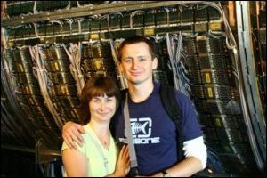

Home Page of Ireneusz (Irek) SZCZEŚNIAK
=======================================

I'm a researcher and an academic teacher at the Institute of Computer
and Information Sciences of the Częstochowa University of Technology,
Poland.  I'm interested in optical networks, specifically the
fixed-mobile integration and the elastic optical networks.  I have a
PhD in computer science from the Polish Academy of Sciences for my
work on performance evaluation of optical packet-switched networks.  I
have worked at various laboratories and companies in the USA, and have
got several awards, most notably the Polish National Science Center
fellowship and the Fulbright fellowship.  But most of all, I'm a
programmer.

Curriculum vitae
----------------

[Download my CV in the PDF format.](cv.pdf)

Publications
------------

[Click here, to go further.](publications)

Dla studentów
-------------

[Kliknij tutaj, aby przejść dalej](dydaktyka)

Projects
--------

These are the current and past projects:

* [Generic Dijkstra](gd)
* [The ABCD software](abcd)
* [The PERFOR software](perfor)
* [The AVAILA software](availa)
* [The SDI software](sdi)
* [The OPUS software](opus)
* [The dxhdf5 package](dxhdf5)
* [The GRIN package](projects/grin)
* [Projects at ETS](projects/ets)
* [The travel advisor](projects/eote)

Other stuff
-----------

* [My wife's site](http://www.wozna.org)
* [My mom's site](http://www.halinaszczesniak.org)
* [My bro's site](http://ultra.cto.us.edu.pl/%7Ekport)
* [My games for Atari](atari)

Contact
-------

E-mail: <irek@irkos.org>
