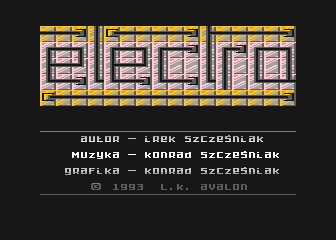
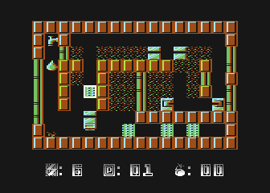
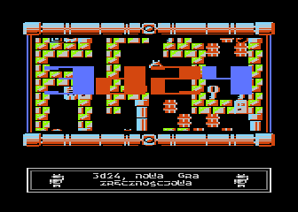
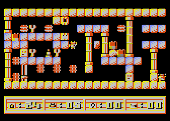

<!-- -*- coding: utf-8 -*- -->

# My games for Atari

When I was a teenager, I wrote with my brother Konrad some games for
the [Atari 8-bit
computers](http://en.wikipedia.org/wiki/Atari_8-bit_family).  We even
sold one of our games to a software company!  Below there are the
screenshots of our two games: Electra and 3d24.  You can run these
games on a PC with the [Atari800 emulator](https://atari800.github.io/).

## Electra

 

## 3d24

 
